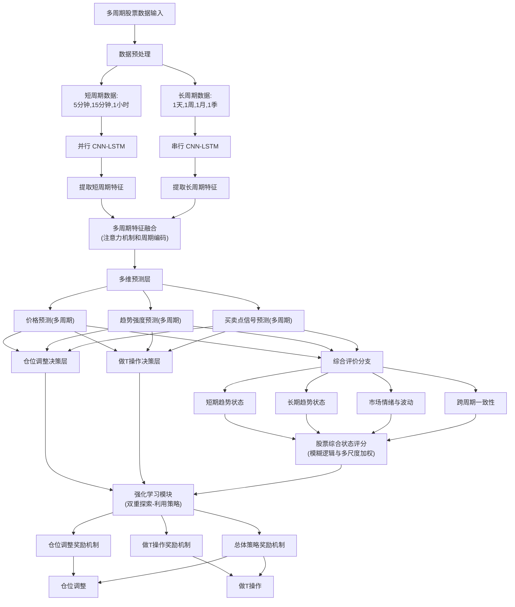

---
# 多周期深度学习模型设计文档V2.4

## 1. 概述

本设计文档旨在构建一个基于多周期数据的深度学习交易模型。这个模型通过综合不同周期的市场数据（如5分钟、15分钟、1小时、1天、1周等），能够在市场的短期和长期波动信息之间找到有效的关联，最终实现仓位调整和做T操作的两大交易决策。我们采用强化学习来优化模型的学习过程，通过奖励机制使模型在不同市场条件下找到最佳决策路径。

## 2. 模型设计

### 2.1 多周期数据输入

**基础概念**
市场数据通常具有不同的周期性，短周期数据（如5分钟、15分钟）能够更快地反映市场的波动情况，有助于识别短期趋势；而长周期数据（如1天、1周）则能反映市场的整体趋势。通过多周期数据输入，模型能够获得短期和长期的市场信息，避免只关注某一个时间尺度而忽略其他重要信息。

**设计方法**
1. **输入数据的选择**：
   - 每个周期的数据包括开盘价、收盘价、最高价、最低价等基本价格数据
   - 技术指标（如移动平均线MA、MACD）
   - 成交量数据，用于反映市场的参与度和趋势强弱

2. **数据对齐与预处理**：
   - 通过小周期累加计算的方式将对长周期数据转换转换为短周期对应时刻值
   - ~~或将短周期的数据聚合成长周期~~
   - 确保数据的一致性和可比性

**数据处理与标幺化**
为了保证不同时间尺度和不同指标间的数据一致性，我们采用标幺化处理，即对所有输入数据进行归一化，使得各个数据维度具有可比性。
- **标幺化公式**：  
    对于每个指标的值 $X(n)$，其标幺化值为：
    $$
    X_{norm}(n) = \frac{X(n) - X_{min}}{X_{max} - X_{min}}
    $$
    其中 $X_{max}$ 和 $X_{min}$ 是该指标的历史最高和最低值。

- **移动均线标幺化**：  
    例如，针对MA3指标，其历史均值计算为：
    $$
    MA3_{norm}(t_i) = \frac{MA3(t_i)}{Y(t_i)}
    $$
    类似的，偏离值、斜率、背离等也按照相同的原则进行标幺化处理。


#### 2.1.1 MA均线体系

##### 2.1.1.1 基础指标计算
1. 日内均值：
   $$AVE(t_i) = \frac{Open(t_i) + High(t_i) + Low(t_i) + Close(t_i)}{4}$$

2. 移动平均值（x = 3, 5, 10, 20）：
   $$MA_x(t_i) = \frac{1}{x}\sum_{k=0}^{x-1}Close(t_i-k)$$
	$$MA_x{norm}(t_i) = \frac{1}{x\cdot Y(t_i)}\sum_{k=0}^{x-1}Close(t_i-k)$$
3. 历史均值：
   $$Y(t_i) = (1-\alpha)Y(t_i-1) + \alpha \cdot AVE(t_i)$$
   其中 $\alpha = \frac{1}{T}$，T为时间窗口（如100个周期）

##### 2.1.1.2 MA指标状态量
1. 斜率：
   $$SLP_x(t_i) = \frac{MA_x(t_i) - MA_x(t_i-1)}{MA_x(t_i-1) \cdot Y(t_i)}$$

2. 均线偏离度：
   $$DV_x(t_i) = \frac{MA_x(t_i) - AVE(t_i)}{MA_x(t_i) \cdot Y(t_i)}$$

3. 偏离斜率：
   $$DV\_SLP_x(t_i) = \frac{DV_x(t_i) - DV_x(t_i-1)}{DV_x(t_i-1)\cdot Y(t_i)}$$

4. 均线排列状态：
   $$MA\_STATE(t_i) = \begin{cases}
   2, & \text{if } MA_3 > MA_5 > MA_{10} > MA_{20} \\
   1, & \text{if } MA_3 > MA_5 \text{ and } MA_{10} > MA_{20} \\
   -1, & \text{if } MA_3 < MA_5 \text{ and } MA_{10} < MA_{20} \\
   -2, & \text{if } MA_3 < MA_5 < MA_{10} < MA_{20} \\
   0, & \text{otherwise}
   \end{cases}$$

#### 2.1.2 MACD指标体系

##### 2.1.2.1 基础指标计算 (优化参数为5,10,5)
1. 快速指数移动平均线（EMA5）：
   $$EMA_5(t_i) = \frac{2}{6}Close(t_i) + \frac{4}{6}EMA_5(t_i-1)$$

2. 慢速指数移动平均线（EMA10）：
   $$EMA_{10}(t_i) = \frac{2}{11}Close(t_i) + \frac{9}{11}EMA_{10}(t_i-1)$$

3. DIFF线：
   $$DIFF(t_i) = EMA_5(t_i) - EMA_{10}(t_i)$$

4. DEA线：
   $$DEA(t_i) = \frac{2}{6}DIFF(t_i) + \frac{4}{6}DEA(t_i-1)$$

5. MACD柱：
   $$MACD(t_i) = 2(DIFF(t_i) - DEA(t_i))$$

##### 2.1.2.2 MACD状态量
1. DEA偏离：
   $$DEA\_DV(t_i) = \frac{DEA(t_i)}{Y(t_i)}$$

2. DEA斜率：
   $$DEA\_SLP(t_i) = \frac{DEA(t_i) - DEA(t_i-1)}{DEA(t_i-1)\cdot Y(t_i)}$$

3. MACD动量：
   $$MACD\_MOM(t_i) = \frac{MACD(t_i) - MACD(t_i-1)}{|MACD(t_i-1)|\cdot Y(t_i)}$$


#### 2.1.3 成交量分析

##### 2.1.3.1 基础指标计算
1. 成交量移动平均：
   $$VOL\_MA_5(t_i) = \frac{1}{5}\sum_{k=0}^{4}Volume(t_i-k)$$

2. 成交量相对变化率：
   $$VOL\_RATE(t_i) = \frac{Volume(t_i) - VOL\_MA_5(t_i)}{VOL\_MA_5(t_i)}$$

##### 2.1.3.2 成交量状态量
1. 量价关系：
   $$VOL\_PRICE\_RATIO(t_i) = \frac{VOL\_RATE(t_i)}{Y(t_i)}$$

2. 成交量趋势：
   $$VOL\_TREND(t_i) = \begin{cases}
   2, & \text{if } VOL\_RATE > 0.5 \text{ and 连续上升} \\
   1, & \text{if } VOL\_RATE > 0 \\
   -1, & \text{if } VOL\_RATE < 0 \\
   -2, & \text{if } VOL\_RATE < -0.5 \text{ and 连续下降} \\
   0, & \text{otherwise}
   \end{cases}$$


#### 2.1.4 每个周期输入参数

**MA均线体系**
分别给出信号如下：
$$[MA_3{norm},SLP_3,DV_3,DV\_SLP_3]$$
$$[MA_5{norm},SLP_5,DV_5,DV\_SLP_5]$$
$$[MA_{10}{norm},SLP_{10},DV_{10},DV\_SLP_{10}]$$
$$[MA_{20}{norm},SLP_{20},DV_{20},DV\_SLP_{20}]$$
$$MA\_STATE$$
整合之后信号如下，共17个信号：
$$[MA_3{norm},SLP_3,DV_3,DV\_SLP_3,MA_5{norm},SLP_5,DV_5,DV\_SLP_5,MA_{10}{norm},SLP_{10},DV_{10},DV\_SLP_{10},MA_{20}{norm},SLP_{20},DV_{20},DV\_SLP_{20},MA\_STATE]$$

**MACD指标体系**
共3个信号
$$[DEA\_DV,DEA\_SLP,MACD\_MOM]$$

**成交量体系**
共3个信号
$$[VOL\_RATE,VOL\_PRICE\_RATIO,VOL\_TREND]$$

**综上整合之后，每个周期需要给入的信号如下**
$$[period\_code,open,high,low,colse,volume,MA_3{norm},SLP_3,DV_3,DV\_SLP_3,MA_5{norm},SLP_5,DV_5,DV\_SLP_5,MA_{10}{norm},SLP_{10},DV_{10},DV\_SLP_{10},MA_{20}{norm},SLP_{20},DV_{20},DV\_SLP_{20},MA\_STATE,DEA\_DV,DEA\_SLP,MACD\_MOM,VOL\_RATE,VOL\_PRICE\_RATIO,VOL\_TREND]$$
合并之后共有6+17+3+3=29个信号，可依些向量去制作特征工程。

#### 2.1.5 特征工程
获取到的不同周期数据进行特征参数计算。
TBD


---

### 2.2 特征提取

在深度学习模型中，我们通过一系列神经网络来从数据中提取信息。以下是用于特征提取的两种常见网络：**卷积神经网络（CNN）** 和 **长短期记忆网络（LSTM）**。

#### 2.2.1 卷积神经网络（CNN）
**CNN的作用**：卷积神经网络特别适合处理具有空间或时间依赖的数据，能够高效地捕捉到输入数据的局部特征。对于交易数据来说，CNN可以识别市场波动中的短期模式，如急剧上升或快速下跌的形态。

**为什么选择CNN**：在多周期数据中，短周期数据中往往包含较多的波动信息。CNN可以通过局部卷积捕捉到这些短期变化的特征，并有效过滤噪声信息。例如，5分钟的价格变化可以看作时间序列数据，CNN可以提取其中的高频特征，以便做T网络更好地判断短期操作时机。

#### 2.2.2 长短期记忆网络（LSTM）
**LSTM的作用**：LSTM是一种特殊的递归神经网络（RNN），能够捕捉时间序列中的长期依赖关系。LSTM通过“记忆”机制，能够将较长时间前的数据（如多天或多周前）对当前市场趋势的影响加以考虑，非常适合处理趋势型的时间序列。

**为什么选择LSTM**：LSTM在处理长周期趋势上具有优势，可以识别市场的长期趋势。对于1天、1周等长周期数据，LSTM能够逐步捕捉数据中的趋势变化，从而为仓位调整提供支持。例如，LSTM可以识别出市场的逐步上升趋势，从而判断出仓位可以逐步加仓的操作。

#### 2.2.3 短周期数据的并行CNN-LSTM结构

短周期（如5分钟、15分钟、1小时等）的数据特点是价格波动频繁，包含短期趋势与波动性。为有效捕捉这些特征，模型在短周期数据上采用**并行CNN-LSTM架构**。

##### 2.2.3.1 CNN部分
- **CNN部分**：
  - 提取短周期内的局部波动性特征，如快速上涨或下跌的价格形态。
  - 例如5分钟数据，通过卷积操作捕捉5分钟内的涨跌形态。
  
- **结构设计**：
  - 3层卷积层
  - 每层后接BatchNormalization和ReLU激活
  - 最大池化层用于降维

- **功能特点**：
  - 提取短期局部波动特征
  - 识别价格形态模式
  - 过滤高频噪声

- **参数设置**：
  ```
  Layer 1: Conv1D(filters=64, kernel_size=3, padding='same')
  Layer 2: Conv1D(filters=128, kernel_size=3, padding='same')
  Layer 3: Conv1D(filters=256, kernel_size=3, padding='same')
  ```

##### 2.2.3.2 LSTM部分
- **LSTM部分**：
  - 捕捉短周期内的短时间趋势信息，比如5分钟内的短期价格趋势。
  - LSTM在并行结构中专注于识别价格走势的连续性和短期趋势信息。
  
- **结构设计**：
  - 2层LSTM
  - Dropout层用于防止过拟合
  - 时间分布式全连接层

- **功能特点**：
  - 捕捉短期趋势信息
  - 处理时序依赖关系
  - 识别价格走势的连续性

- **参数设置**：
  ```
  Layer 1: LSTM(units=128, return_sequences=True)
  Layer 2: LSTM(units=64, return_sequences=True)
  ```


##### 2.2.3.3 特征融合
- **特征融合层**：
  - 将CNN和LSTM的输出特征拼接在一起，形成该周期的“综合特征”，结合了波动性和短期趋势。
  
- **融合方法**：
  ```python
  def feature_fusion(cnn_features, lstm_features):
      # 特征拼接
      combined_features = concatenate([cnn_features, lstm_features], axis=-1)
      # 特征降维
      fusion_layer = Dense(256)(combined_features)
      return fusion_layer
  ```


#### 2.2.4 长周期数据的串行CNN-LSTM结构

长周期（如1天、1周、1月等）数据由于时间跨度大，更适合层次化的特征提取。因此，模型在长周期数据上采用**先CNN后LSTM的串行结构**。
- **优点**：这种先提取局部特征再处理长时间依赖的层次结构，能够更好地识别周期内的长期趋势，是长周期数据处理的最佳选择。

##### 2.2.4.1 CNN前处理
- **CNN部分**：
  - CNN先提取长周期中的局部波动特征，例如在每日数据上提取每个交易日的涨跌模式。
  
- **结构设计**：
  - 2层卷积层
  - 残差连接
  - 注意力机制

- **功能特点**：
  - 提取长期价格形态
  - 识别重要的周期性模式
  - 过滤非关键信息

- **参数设置**：
  ```
  Layer 1: Conv1D(filters=32, kernel_size=5, padding='same')
  Layer 2: Conv1D(filters=64, kernel_size=5, padding='same')
  ```


##### 2.2.4.2 LSTM主体
- **LSTM部分**：
  - LSTM接收CNN提取的特征，进一步捕捉更长时间的趋势，识别出周期内的整体趋势变化。

- **结构设计**：
  - 3层LSTM
  - 双向LSTM层
  - 自注意力机制

- **功能特点**：
  - 处理长期依赖关系
  - 捕捉市场周期性变化
  - 识别趋势转折点

- **参数设置**：
  ```
  Layer 1: Bidirectional(LSTM(units=128, return_sequences=True))
  Layer 2: LSTM(units=96, return_sequences=True)
  Layer 3: LSTM(units=64, return_sequences=True)
  ```


---

### 2.3 多周期特征融合后的预测层设计

在多周期特征融合后的模型预测层，我们通过引入**周期编码**和**注意力机制**进行多周期处理，以确保价格、趋势强度和买卖点信号的多周期预测准确性。

#### 2.3.1 周期编码模块

在多周期特征融合后的模型预测层，我们通过引入周期编码和注意力机制进行多周期处理，以确保价格、趋势强度和买卖点信号的多周期预测准确性。
- **周期编码（Period Encoding）**：
  - 将每个周期（5分钟、15分钟、1小时、1天、1周、1月、1季）用周期编码标识。
  - 将周期编码作为额外输入，以便模型可以区分不同周期特征，捕捉每个周期特有的波动特性和趋势规律。
##### 2.3.1.1 周期编码设计
```python
def period_encoding(period_id, max_periods=7):
    """
    将每个周期（5分钟、15分钟、1小时、1天、1周、1月、1季）编码
    """
    # 位置编码
    position = np.array([
        [pos / np.power(10000, 2 * (j // 2) / max_periods)
         for j in range(max_periods)]
        for pos in range(period_id + 1)
    ])
    
    # 正弦编码
    position[:, 0::2] = np.sin(position[:, 0::2])
    position[:, 1::2] = np.cos(position[:, 1::2])
    
    return position
```

##### 2.3.1.2 周期特征增强
```python
def enhance_features(features, period_encoding):
    """
    增强特征表示
    """
    # 特征与周期编码的融合
    enhanced = concatenate([features, period_encoding], axis=-1)
    # 特征增强层
    enhanced = Dense(256, activation='relu')(enhanced)
    return enhanced
```

#### 2.3.2 注意力机制

- **多周期注意力机制**：
  - 在价格预测层、趋势强度层、买卖点信号层中加入基于周期的自适应注意力模块。该模块根据不同周期的输入数据自动调整关注度。
  - 例如，短期价格预测可以集中在高频周期（5分钟、15分钟），而长期趋势强度和买卖点信号可以更多关注低频周期（1天、1周）。
  
##### 2.3.2.1 自注意力层
```python
def self_attention(inputs):
    """
    处理周期内的特征关联
    """
    # 计算注意力权重
    attention = Dense(inputs.shape[-1])(inputs)
    attention = Softmax(axis=1)(attention)
    
    # 应用注意力
    attended = multiply([inputs, attention])
    return attended
```

##### 2.3.2.2 交叉注意力层
```python
def cross_attention(query, key, value):
    """
    处理不同周期间的特征关联
    """
    # 计算注意力分数
    score = dot([query, key], axes=[2, 2])
    score = Softmax(axis=-1)(score)
    
    # 加权求和
    attended = dot([score, value], axes=[2, 1])
    return attended
```

#### 2.3.3 特征融合策略

特征融合采用自适应权重的多层次融合方案，确保不同周期的特征能够根据市场状态动态调整其重要性。
- **共享和独立权重机制**：
  - 对于价格、趋势、买卖点三个预测层的多周期特征进行**部分共享权重**（例如短周期共享），同时为每个层的每个周期建立独立参数化分支。
  - 这样可以使模型既能对短周期和长周期特征进行差异化处理，也能对共性信息进行有效提取和融合。
##### 2.3.3.1 分层融合机制
```python
def hierarchical_fusion(short_features, mid_features, long_features, market_state):
    """
    多层次特征融合
    """
    # 计算自适应权重
    weights = compute_adaptive_weights(market_state)
    
    # 加权融合
    fused_features = (
        weights[0] * short_features +
        weights[1] * mid_features +
        weights[2] * long_features
    )
    
    return fused_features
```

##### 2.3.3.2 权重自适应
```python
def compute_adaptive_weights(market_state):
    """
    基于市场状态计算自适应权重
    """
    # 市场波动性评估
    volatility = market_state['volatility']
    trend_strength = market_state['trend_strength']
    
    # 权重计算
    short_weight = softmax(volatility)
    mid_weight = softmax(trend_strength)
    long_weight = 1 - short_weight - mid_weight
    
    return [short_weight, mid_weight, long_weight]
```

通过这种分层的特征提取和融合设计，模型能够有效地处理不同周期的市场数据，并在保持时序特征的同时，捕捉到市场的多尺度特征。每个组件都经过精心设计，以确保能够准确捕捉市场的各种模式和特征。


---

### 2.4 预测层

预测层分为三个主要分支：价格预测、趋势强度预测和买卖点信号预测。每个分支都基于多周期融合特征，通过不同的网络结构实现特定的预测任务。

#### 2.4.1 价格预测分支

##### 2.4.1.1 多周期价格预测
```python
def price_prediction_branch(fused_features):
    """
    多周期价格预测网络
    """
    # 价格预测主干网络
    x = Dense(256, activation='relu')(fused_features)
    x = Dropout(0.3)(x)
    
    # 多周期预测头
    predictions = {
        'short_term': Dense(1, name='price_5min')(x),
        'mid_term': Dense(1, name='price_1hour')(x),
        'long_term': Dense(1, name='price_1day')(x)
    }
    
    return predictions
```

##### 2.4.1.2 波动率预测
```python
def volatility_prediction(fused_features):
    """
    价格波动率预测
    """
    x = Dense(128, activation='relu')(fused_features)
    x = Dropout(0.2)(x)
    
    # 预测未来波动率
    volatility = Dense(1, activation='relu', name='volatility')(x)
    return volatility
```

#### 2.4.2 趋势强度预测分支

##### 2.4.2.1 趋势方向判断
```python
def trend_direction_prediction(fused_features):
    """
    趋势方向预测（上涨、下跌、盘整）
    """
    x = Dense(128, activation='relu')(fused_features)
    x = BatchNormalization()(x)
    
    # 三分类输出
    direction = Dense(3, activation='softmax', name='trend_direction')(x)
    return direction
```

##### 2.4.2.2 趋势持续性预测
```python
def trend_persistence_prediction(fused_features):
    """
    趋势持续性预测
    """
    x = Dense(128, activation='relu')(fused_features)
    x = Dropout(0.3)(x)
    
    # 预测趋势持续概率
    persistence = Dense(1, activation='sigmoid', name='trend_persistence')(x)
    return persistence
```

#### 2.4.3 买卖点信号预测分支

##### 2.4.3.1 短期买卖点识别
```python
def trading_signal_detection(fused_features):
    """
    短期交易信号预测
    """
    x = Dense(256, activation='relu')(fused_features)
    x = BatchNormalization()(x)
    
    # 多头信号、空头信号、观望信号
    signals = Dense(3, activation='softmax', name='trading_signals')(x)
    return signals
```

##### 2.4.3.2 趋势拐点预测
```python
def trend_reversal_prediction(fused_features):
    """
    趋势拐点预测
    """
    x = LSTM(128, return_sequences=True)(fused_features)
    x = Dense(64, activation='relu')(x)
    
    # 预测拐点概率
    reversal_prob = Dense(1, activation='sigmoid', name='reversal_probability')(x)
    return reversal_prob
```

### 2.5 决策层

决策层负责将预测结果转化为具体的交易决策，包括仓位调整和做T操作两个主要部分。
仓位调整和做T操作有不同的侧重点，分别对应于不同的决策策略。由于我们有两种不同的操作需求（仓位调整和做T），因此决策层被分为两个子网络：**仓位调整网络**和**做T网络**。

#### 2.5.1 仓位调整决策网络

主要利用长周期特征来生成仓位策略。例如，市场处于长期上升趋势时，该网络会建议增加仓位；若市场进入下行趋势，则建议减仓。

- **多周期数据综合判断**：在多个周期的特征融合基础上，判断当前市场的方向，并进行仓位调整。
- **奖励反馈**：通过每日的整体收益来判断仓位调整的效果，强化学习反馈机制会给出相应奖励。

##### 2.5.1.1 仓位策略生成
```python
class PositionStrategy:
    def __init__(self, risk_threshold=0.3):
        self.risk_threshold = risk_threshold
    
    def generate_position_decision(self, predictions, current_position):
        """
        生成仓位调整决策
        """
        trend_strength = predictions['trend_persistence']
        volatility = predictions['volatility']
        market_direction = predictions['trend_direction']
        
        # 风险评估
        risk_score = self._calculate_risk_score(volatility, trend_strength)
        
        # 基础仓位建议
        if risk_score < self.risk_threshold:
            if market_direction[0] > 0.7:  # 强势上涨
                return min(1.0, current_position + 0.2)
            elif market_direction[2] > 0.7:  # 强势下跌
                return max(0.0, current_position - 0.3)
        
        return current_position
    
    def _calculate_risk_score(self, volatility, trend_strength):
        return volatility * (1 - trend_strength)
```

##### 2.5.1.2 风险控制策略
```python
class RiskController:
    def __init__(self, max_position=1.0, min_position=0.0):
        self.max_position = max_position
        self.min_position = min_position
    
    def apply_risk_constraints(self, position_decision, market_state):
        """
        应用风险控制规则
        """
        # 检查市场状态
        if market_state['volatility'] > 0.5:
            return min(position_decision, 0.5)
        
        # 应用基本约束
        position = np.clip(position_decision, self.min_position, self.max_position)
        return position
```

#### 2.5.2 做T操作决策网络
主要关注短周期（5分钟、15分钟等）数据特征的快速反应，识别适合做T的买卖点。该网络的任务是利用市场的短期波动进行频繁的短期操作，以便在短期内获得快速盈利。例如，做T网络会在短期出现低买高卖的机会时发出信号，实现波段操作。

- **短周期特征驱动**：主要依赖短周期数据的并行CNN和LSTM特征，从而快速捕捉到短线波动。
- **奖励反馈**：每次短线交易后的收益决定做T操作的反馈奖励，强化模型对做T时机的判断。

##### 2.5.2.1 短期交易策略
```python
class ShortTermTrading:
    def __init__(self, min_profit_threshold=0.002):
        self.min_profit_threshold = min_profit_threshold
    
    def generate_trading_signal(self, predictions, current_price):
        """
        生成做T交易信号
        """
        signals = predictions['trading_signals']
        volatility = predictions['volatility']
        
        if signals[0] > 0.7 and volatility < 0.3:  # 买入信号
            return {
                'action': 'BUY',
                'price': current_price,
                'stop_loss': current_price * 0.995
            }
        elif signals[1] > 0.7:  # 卖出信号
            return {
                'action': 'SELL',
                'price': current_price,
                'take_profit': current_price * 1.005
            }
        
        return {'action': 'HOLD'}
```

##### 2.5.2.2 高频交易策略
```python
class HighFrequencyTrading:
    def __init__(self, min_interval=5):
        self.min_interval = min_interval
        self.last_trade_time = None
    
    def execute_trading_decision(self, signal, market_data):
        """
        执行高频交易决策
        """
        if not self._check_trading_interval():
            return None
        
        if signal['action'] in ['BUY', 'SELL']:
            trade = self._create_trade_order(signal, market_data)
            self.last_trade_time = market_data['timestamp']
            return trade
        
        return None
    
    def _check_trading_interval(self):
        if self.last_trade_time is None:
            return True
        
        time_elapsed = time.time() - self.last_trade_time
        return time_elapsed >= self.min_interval
```

### 2.6 评价系统

评价系统采用模糊逻辑和多尺度加权机制，对市场状态和交易决策进行综合评估。

#### 2.6.1 模糊逻辑评分系统

- **模糊逻辑评分（Fuzzy Logic Scoring）**：
  - 针对短期趋势状态、长期趋势状态、市场情绪与波动、跨周期一致性等指标引入模糊逻辑评分。
  - 评分区间可以设定为0-1之间的连续值，而不是二值或离散评分。例如，短期趋势可以用0.1到1表示不同程度的上升趋势，0到-1表示下降趋势。
  - 模糊逻辑评分有助于减少评分的单一数值误差，提高模型对市场小幅波动的容错能力。

- **多尺度加权评价**：
  - 使用多尺度加权机制，以不同权重来衡量各周期下的特征重要性。例如：
    - 在短周期评价中（5分钟、15分钟、1小时），市场情绪与波动特征权重较高，以提高短期敏感性。
    - 在长周期评价中（1天、1周、1月、1季），长期趋势状态和跨周期一致性权重较高，有助于把握宏观趋势。
  - 权重可以动态调整，以适应不同市场环境。根据市场波动率的变化，适当提升或降低短周期和长周期的权重占比。

- **股票状态综合评分**：
  - 最终的股票状态评分可以基于各指标的模糊逻辑评分及加权得分进行综合计算，生成0-1区间的状态评分，反映股票的综合健康状态、趋势强度和短中长期机会。

##### 2.6.1.1 模糊评分计算
```python
class FuzzyEvaluator:
    def __init__(self):
        self.membership_functions = self._initialize_membership_functions()
    
    def evaluate_market_state(self, indicators):
        """
        市场状态模糊评分
        """
        scores = {
            'trend_score': self._evaluate_trend(indicators['trend']),
            'volatility_score': self._evaluate_volatility(indicators['volatility']),
            'consistency_score': self._evaluate_consistency(indicators['consistency'])
        }
        
        return scores
    
    def _evaluate_trend(self, trend_value):
        """
        趋势强度模糊评分
        """
        if trend_value > 0.8:
            return 1.0
        elif trend_value < 0.2:
            return 0.0
        else:
            return (trend_value - 0.2) / 0.6
```

##### 2.6.1.2 评分维度设计
```python
class EvaluationDimensions:
    @staticmethod
    def calculate_dimensions(market_data, predictions):
        """
        计算各评价维度得分
        """
        dimensions = {
            'short_term': {
                'trend': market_data['short_term_trend'],
                'volatility': market_data['short_term_volatility'],
                'volume': market_data['volume_change']
            },
            'long_term': {
                'trend': market_data['long_term_trend'],
                'support_resistance': market_data['support_resistance'],
                'momentum': market_data['momentum']
            }
        }
        
        return dimensions
```

通过这些详细的设计实现，模型能够在多个层次上进行预测和决策，同时通过评价系统保证决策的合理性和有效性。每个组件都经过精心设计，以确保能够准确捕捉市场的各种模式和特征，并做出相应的交易决策。

---

### 2.7 强化学习优化系统

强化学习系统通过奖励机制优化模型的交易决策，采用双重探索-利用策略和在线自适应微调来提升模型性能。

#### 2.7.1 强化学习策略设计

强化学习模块通过引入**双重探索-利用策略**和**在线自适应微调机制**，确保模型能够更灵活地适应不同的市场条件，从而做出更准确的仓位调整和做T操作决策。

- **双重探索-利用策略（Dual Explore-Exploit Strategy）**：
  - **短期策略**：快速响应市场波动，通过频繁调整来获取短期收益。短期策略主要对做T操作进行优化，使模型在短周期高波动市场中能够抓住机会。
  - **长期策略**：在追求长期表现的同时兼顾收益稳定性，侧重于仓位调整决策。长期策略关注较低频的周期（如1周、1月），避免频繁调整仓位，减少交易成本。
  - 在训练中，模型可以使用渐进式权重转移，将短期策略的权重逐渐转移到长期策略上。这种方式能够确保模型在训练初期更多关注短期收益，而在稳定阶段更专注于长期收益。

- **自适应奖励机制**：
  - 在奖励函数中引入基于市场条件的动态调整。奖励函数会根据市场波动率、趋势方向等因素自动调整激励力度。
  - 在高波动市场中，强化奖励机制偏向激励做T操作；在趋势市场中，仓位调整的奖励权重较高。
  - 自适应奖励机制可提升模型在不同市场环境下的决策效率和收益表现。

- **在线微调机制**：
  - 在线微调主要针对学习率、探索率等关键参数。每隔一段时间（例如每月或每周），根据模型的近期收益表现和市场变化情况，自动调整这些参数。
  - 在线微调可以确保模型在长时间运行后，仍然具备动态适应性，保持最佳状态以应对复杂多变的市场环境。

##### 2.7.1.1 双重探索-利用策略
```python
class DualExplorationStrategy:
    def __init__(self, epsilon_short=0.3, epsilon_long=0.1):
        self.epsilon_short = epsilon_short  # 短期探索率
        self.epsilon_long = epsilon_long    # 长期探索率
        
    def select_action(self, q_values, state, mode='short'):
        """
        基于epsilon-greedy策略选择动作
        """
        epsilon = self.epsilon_short if mode == 'short' else self.epsilon_long
        
        if np.random.random() < epsilon:
            return np.random.choice(len(q_values))  # 探索
        else:
            return np.argmax(q_values)  # 利用
            
    def update_epsilon(self, performance_metrics):
        """
        根据性能指标动态调整探索率
        """
        if performance_metrics['reward_trend'] > 0:
            self.epsilon_short *= 0.995  # 逐渐减少探索
        else:
            self.epsilon_short = min(0.4, self.epsilon_short * 1.005)
```

##### 2.7.1.2 在线自适应微调机制
```python
class OnlineAdapter:
    def __init__(self, learning_rate=0.001, window_size=1000):
        self.learning_rate = learning_rate
        self.window_size = window_size
        self.performance_history = []
        
    def adapt_parameters(self, model, recent_performance):
        """
        在线调整模型参数
        """
        self.performance_history.append(recent_performance)
        
        if len(self.performance_history) >= self.window_size:
            # 评估近期表现
            recent_avg = np.mean(self.performance_history[-self.window_size:])
            
            # 动态调整学习率
            if recent_avg < 0:
                self.learning_rate *= 0.9
            else:
                self.learning_rate = min(0.01, self.learning_rate * 1.1)
            
            # 更新模型参数
            self._update_model_parameters(model)
            
    def _update_model_parameters(self, model):
        """
        更新模型参数
        """
        for layer in model.layers:
            if hasattr(layer, 'learning_rate'):
                layer.learning_rate = self.learning_rate
```

#### 2.7.2 仓位调整奖励机制

仓位调整的目标是最大化长期收益，控制风险，避免频繁操作。

- **状态空间**
- 当前市场状态（包括多周期输入的市场数据和技术指标）。
- 当前仓位比例。

- **动作空间**
- 增加仓位（Buy More）
- 减少仓位（Sell Partially）
- 保持仓位不变（Hold）
- 清仓（Sell All）

- **奖励设计**
1. **收益奖励**：若仓位调整后在一个长期周期内（如1周或1月）带来了正收益，则给予奖励，奖励值与收益额成正比。
2. **风险控制奖励**：若在市场高波动期采取了减少仓位的操作，给予额外奖励。
3. **稳定性奖励**：在仓位调整的策略能够保证长时间收益稳定，则奖励。

##### 2.7.2.1 状态空间与动作空间设计
```python
class PositionRewardSystem:
    def __init__(self):
        self.state_space = {
            'market_state': ['price', 'volume', 'trend', 'volatility'],
            'position_state': ['current_position', 'position_duration'],
            'risk_metrics': ['var', 'max_drawdown', 'sharp_ratio']
        }
        
        self.action_space = {
            'increase_position': [0.1, 0.2, 0.3],
            'decrease_position': [-0.3, -0.2, -0.1],
            'hold_position': [0]
        }
        
    def get_state(self, market_data, portfolio_data):
        """
        构建当前状态向量
        """
        state = np.concatenate([
            self._normalize_market_data(market_data),
            self._normalize_portfolio_data(portfolio_data)
        ])
        return state
```

##### 2.7.2.2 奖励计算
```python
class PositionRewardCalculator:
    def __init__(self, risk_free_rate=0.02):
        self.risk_free_rate = risk_free_rate
        
    def calculate_reward(self, action, state, next_state):
        """
        计算仓位调整的奖励
        """
        # 收益奖励
        profit_reward = self._calculate_profit_reward(state, next_state)
        
        # 风险控制奖励
        risk_reward = self._calculate_risk_reward(state, action)
        
        # 稳定性奖励
        stability_reward = self._calculate_stability_reward(action)
        
        # 综合奖励
        total_reward = (
            0.5 * profit_reward +
            0.3 * risk_reward +
            0.2 * stability_reward
        )
        
        return total_reward
    
    def _calculate_profit_reward(self, state, next_state):
        """
        计算收益奖励
        """
        return_rate = (next_state['portfolio_value'] - state['portfolio_value']) / state['portfolio_value']
        excess_return = return_rate - self.risk_free_rate
        return np.clip(excess_return * 100, -10, 10)
    
    def _calculate_risk_reward(self, state, action):
        """
        计算风险控制奖励
        """
        if state['volatility'] > 0.5 and action['decrease_position']:
            return 2.0  # 奖励风险规避行为
        return 0.0
    
    def _calculate_stability_reward(self, action):
        """
        计算稳定性奖励
        """
        return -abs(action['position_change']) * 2  # 惩罚频繁调整
```

#### 2.7.3 做T操作奖励机制

做T的目标是短期内快速获利，减少高频交易损失。

- **状态空间**
- 短周期的市场状态（5分钟、15分钟、1小时数据及短期技术指标）。
- 当前持仓量和流动资金。

- **动作空间**
- 买入（Buy）
- 卖出（Sell）
- 保持不变（Hold）

- **奖励设计**
1. **短期收益奖励**：若在短周期内通过做T获利，则给予正奖励，与收益成正比。
2. **交易成本惩罚**：对频繁操作产生的交易成本进行惩罚，鼓励减少无意义操作。
3. **持仓时间奖励**：在市场不明显波动时选择保持仓位，则额外给予奖励，避免频繁操作。

##### 2.7.3.1 短期交易奖励设计
```python
class TradingRewardSystem:
    def __init__(self, transaction_cost=0.001):
        self.transaction_cost = transaction_cost
        
    def calculate_trading_reward(self, trade_action, market_movement):
        """
        计算做T操作的奖励
        """
        # 基础收益计算
        if trade_action['type'] == 'buy':
            base_reward = (market_movement['high'] - trade_action['price']) / trade_action['price']
        else:
            base_reward = (trade_action['price'] - market_movement['low']) / trade_action['price']
            
        # 考虑交易成本
        net_reward = base_reward - self.transaction_cost
        
        # 添加时间惩罚
        time_penalty = self._calculate_time_penalty(trade_action['hold_time'])
        
        return net_reward - time_penalty
        
    def _calculate_time_penalty(self, hold_time):
        """
        计算持仓时间惩罚
        """
        return 0.0001 * hold_time  # 随持仓时间增加惩罚
```


---

## 3. 系统评估指标

### 3.1 模型性能指标

#### 3.1.1 预测准确性指标
```python
class PredictionMetrics:
    @staticmethod
    def calculate_metrics(predictions, actual_values):
        metrics = {
            'mae': mean_absolute_error(actual_values, predictions),
            'rmse': np.sqrt(mean_squared_error(actual_values, predictions)),
            'direction_accuracy': direction_accuracy(actual_values, predictions)
        }
        return metrics
```

#### 3.1.2 信号质量指标
```python
class SignalQualityMetrics:
    @staticmethod
    def evaluate_signals(trading_signals, price_movements):
        metrics = {
            'precision': precision_score(price_movements, trading_signals),
            'recall': recall_score(price_movements, trading_signals),
            'f1': f1_score(price_movements, trading_signals)
        }
        return metrics
```

### 3.2 交易性能指标

#### 3.2.1 收益率指标
```python
class ReturnMetrics:
    @staticmethod
    def calculate_returns(portfolio_values):
        """
        计算各类收益率指标
        """
        daily_returns = np.diff(portfolio_values) / portfolio_values[:-1]
        
        metrics = {
            'total_return': (portfolio_values[-1] / portfolio_values[0]) - 1,
            'annualized_return': calculate_annualized_return(daily_returns),
            'sharpe_ratio': calculate_sharpe_ratio(daily_returns),
            'max_drawdown': calculate_max_drawdown(portfolio_values)
        }
        return metrics
```

#### 3.2.2 风险调整指标
```python
class RiskAdjustedMetrics:
    @staticmethod
    def calculate_risk_metrics(returns, risk_free_rate=0.02):
        """
        计算风险调整后的性能指标
        """
        metrics = {
            'sharpe_ratio': calculate_sharpe(returns, risk_free_rate),
            'sortino_ratio': calculate_sortino(returns, risk_free_rate),
            'information_ratio': calculate_information_ratio(returns),
            'calmar_ratio': calculate_calmar(returns)
        }
        return metrics
```

---

## 4. 风险控制

### 4.1 系统风险控制

#### 4.1.1 资金管理
```python
class MoneyManager:
    def __init__(self, max_position_size=0.2):
        self.max_position_size = max_position_size
        
    def calculate_position_size(self, signal_strength, account_value):
        """
        计算仓位大小
        """
        base_size = account_value * signal_strength
        return min(base_size, account_value * self.max_position_size)
```

#### 4.1.2 止损策略
```python
class StopLossManager:
    def __init__(self, max_loss_percentage=0.02):
        self.max_loss_percentage = max_loss_percentage
        
    def check_stop_loss(self, current_price, entry_price, position_type='long'):
        """
        检查是否触发止损
        """
        if position_type == 'long':
            loss_percentage = (entry_price - current_price) / entry_price
        else:
            loss_percentage = (current_price - entry_price) / entry_price
            
        return loss_percentage > self.max_loss_percentage
```

### 4.2 模型风险控制

#### 4.2.1 异常检测
```python
class AnomalyDetector:
    def __init__(self, threshold=3):
        self.threshold = threshold
        self.history = []
        
    def detect_anomalies(self, predictions):
        """
        检测异常预测
        """
        z_score = (predictions - np.mean(self.history)) / np.std(self.history)
        return abs(z_score) > self.threshold
```

#### 4.2.2 模型降级机制
```python
class ModelDegradation:
    def __init__(self, performance_threshold=0.5):
        self.performance_threshold = performance_threshold
        
    def check_degradation(self, current_performance, baseline_performance):
        """
        检查模型是否需要降级
        """
        if current_performance < baseline_performance * self.performance_threshold:
            return True
        return False
```

通过这些详细的设计实现，系统能够在保证性能的同时有效控制风险，实现稳定的交易表现。每个组件都经过精心设计，确保系统的可靠性和鲁棒性。


---

## 5. 模型设计流程图



![[_resources/多周期股票分析与决策设计/59c782307095d6435bfdfc3d1a7c93b5_MD5.svg|Open: export-8.svg]]


